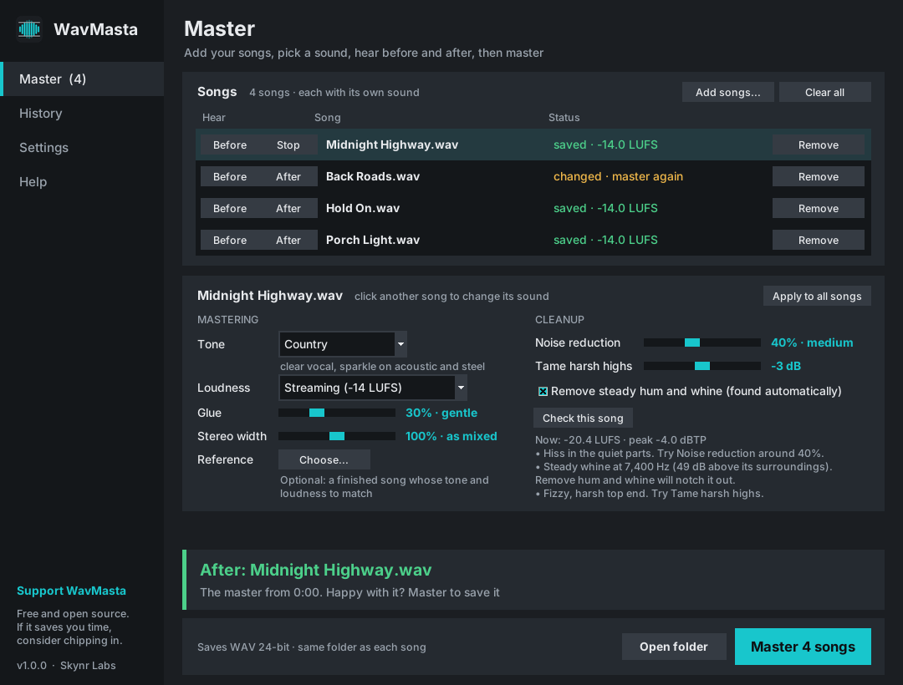

#  WavMasta


[](https://github.com/skynrlabs/WavMasta/actions/workflows/test.yml)
[](https://skynrlabs.itch.io/wavmasta)

[](CONTRIBUTING.md)

> Clean up and master your songs, ready for release.  
> Hiss, hum and harsh highs out. Streaming-ready loudness in.

<p>
  <a href="https://skynrlabs.itch.io/wavmasta"></a>
</p>

Free to download. Pay what you want on [itch.io](https://skynrlabs.itch.io/wavmasta) if it saves you time.



---

## What Is WavMasta?

WavMasta is a free desktop tool that takes your finished mix and makes it release-ready. It checks the song for problems (steady hiss, mains hum, a whine, fizzy top end), cleans them up, gives it a gentle tone shape and glue, and brings it to the right loudness for Spotify, Apple Music and YouTube with peaks kept safely under the ceiling.

Press **Before** and **After** on any song to hear the difference at equal loudness, then **Master** to save `<song> - master.wav` next to the original. Your original is never changed.

---

## 💬 Why WavMasta?

Getting a mix to sound finished usually means a chain of plugins, a loudness meter and a lot of guessing. Online mastering services work, but they cost money per song and you can't see what they did.

WavMasta does the standard mastering steps in one window, tells you in plain English what it found and what it changed, and lets you hear the result fairly before you save anything.

---

## ✨ Features

- 🔍 **Check this song**: measures loudness and true peak, and finds hiss, hum, whine, harsh highs and clipping, with suggested fixes
- 🧹 **Noise reduction**: a gentle de-hisser that works where hiss lives (above 1 kHz) and never touches the bass or the body of the mix
- 🔌 **Hum and whine removal**: finds tones that sit there the whole song (50/60 Hz hum, a whine, ringing) and notches them out with very narrow filters, while the notes in your music are left alone
- ✨ **Tame harsh highs**: softens fizzy, brittle top end, common in AI-generated songs
- 🎚️ **Tone presets**: Neutral, Country, Roots rock, Pop, Warm, Bright, all gentle (within 2 dB)
- 🎯 **Match a reference**: pick a released song you love and WavMasta matches its tonal balance and loudness
- 🧲 **Glue and width**: bus compression to hold the mix together, and stereo width that keeps bass and kick centred
- 📏 **Loudness targets**: Streaming (-14 LUFS), Apple Music (-16), Loud (-11), Very loud (-9), with a true-peak limiter
- ▶️ **Fair before/after**: hear the loudest 20 seconds of the original and the master at the same loudness
- 💾 **Formats**: WAV 24-bit (for distributors), WAV 16-bit with dither (CD), FLAC, MP3 320
- 📦 **Batch and albums**: drop a whole folder; **Apply to all songs** gives an album one sound
- ✅ **Always know where you stand**: each song shows when it's saved, and says *changed · master again* if you tweak it afterwards
- 💻 **GUI and command line**: point and click, or script it

---

## 📥 Install

### Windows (recommended)

1. Download **`WavMasta-Setup-x.y.z.exe`** from [itch.io](https://skynrlabs.itch.io/wavmasta) (pay what you want, $0 is fine).
2. Run it and click through the installer. No Python or admin rights needed.
3. Open **WavMasta** from the Start menu (or the desktop shortcut, if you ticked it).

> Windows may show **"Windows protected your PC"** because the app isn't code-signed yet. Click **More info → Run anyway**.

To update, run the newer installer. To remove, use **Settings → Apps → WavMasta → Uninstall**.

### macOS and Linux

Install with [pipx](https://pipx.pypa.io/) (Python 3.10 or newer):

```bash
pipx install git+https://github.com/skynrlabs/WavMasta.git
wavmasta
```

Run `wavmasta` with no arguments to open the window, or with file names to use the command line. Update with `pipx upgrade wavmasta`.

### From source (for development)

```bash
git clone https://github.com/skynrlabs/WavMasta.git
cd WavMasta
pip install -e .
python -m wavmasta
```

---

## ⚙️ How It Works

Everything happens on the **Master** page, top to bottom:

1. **Drop your songs** (or a whole folder) onto the window, or click **Add songs...** (WAV, FLAC, MP3, AIFF, OGG or M4A). Use your final mix, ideally peaking around -3 to -6 dB with no limiter on the master bus.
2. **Click a song**, then **Check this song**. WavMasta lists what it found; **Use suggestions** sets the cleanup for you.
3. Pick a **Tone** and **Loudness** (or choose a **Reference** song to match). **Apply to all songs** copies the sound to the rest.
4. Press **After** to hear the master and **Before** to hear the original, both from the loudest part of the song at the same loudness. The button turns into **Stop** while it plays.
5. Click **Master** (it says how many songs). Each row shows when its file is saved, and says **changed · master again** if you change a setting afterwards.

**History** lists everything Check, Before/After and Master did; double-click a saved song to open its folder.

**Settings** holds where masters are saved (next to each song by default), the file format, the peak ceiling, whether the folder opens when mastering finishes, and **Reset everything to defaults**.

### The chain

| Step | What it does |
|---|---|
| Rumble filter | Removes sub-bass below 25 Hz you can't hear but that eats loudness |
| Hum and whine | Very narrow notches on steady tones (found on the untouched audio first) |
| Noise reduction | De-hisses above 1 kHz, only what sits near the noise floor |
| Tame harsh highs | A gentle shelf cut above 11 kHz |
| Tone or reference | A gentle EQ shape, or a linear-phase match to your reference song |
| Stereo width | Mid/side width; bass and kick stay centred |
| Glue | Slow-attack bus compression |
| Loudness and limiter | Lands on the target LUFS with true peaks under the ceiling |

### ⌨️ Keyboard shortcuts

| Keys | Action |
|---|---|
| `Ctrl+O` | Add songs |
| `Ctrl+I` | Check the selected song |
| `Ctrl+B` | Hear before |
| `Ctrl+P` | Hear after |
| `Esc` | Stop playback |
| `Ctrl+Enter` | Master |
| `Ctrl+1` to `Ctrl+4` | Master, History, Settings, Help pages |
| `F1` | Help |

---

## 💻 Command Line

For batch jobs and scripts. The command line comes with the pipx and source installs: use `wavmasta` after a pipx install, or `python -m wavmasta` from source.

```bash
wavmasta "My Song.wav" --check
wavmasta "My Song.wav" --tone country --auto
wavmasta *.wav --tone roots-rock --loudness -14 --glue 40 --out masters
wavmasta "My Song.wav" --reference "Favourite Release.flac" --format flac
```

| Option | What it does |
|---|---|
| `--check` | Only measure and report problems; save nothing |
| `--tone` | `neutral`, `country`, `roots-rock`, `pop`, `warm` or `bright` |
| `--loudness` | Target in LUFS (default `-14`) |
| `--ceiling` | True-peak ceiling in dBTP (default `-1`) |
| `--denoise` | Noise reduction `0`-`100` (default `0`) |
| `--no-hum-fix` | Don't notch out steady hum and whine |
| `--tame-highs` | Cut harsh highs, `0`-`6` dB |
| `--glue` | Glue compression `0`-`100` (default `30`) |
| `--width` | Stereo width `0`-`150` (default `100`) |
| `--reference` | A finished song to match tone and loudness to |
| `--auto` | Use the cleanup Check suggests for each song |
| `--format` | `wav` (24-bit), `wav16`, `flac` or `mp3` |
| `--out` | Folder for the mastered files |

---

## 💡 Tips

- Mastering polishes a good mix; it can't fix a bad one. If the vocal is buried or the bass is boomy, fix it in the mix first.
- Louder isn't better on streaming. Spotify and YouTube turn songs down to about -14 LUFS, so a -9 master just ends up sounding flatter.
- Go easy on noise reduction. 30-50% is usually enough; above about 70% it can sound watery. Always check with **After**.
- Clipping in your mix can't be undone. If **Check** reports clipping, export the mix a few dB quieter.
- Upload **WAV 24-bit** to your distributor (DistroKid, CD Baby, TuneCore and others).

---

## 🤝 Contributing

Contributions are welcome. Read [CONTRIBUTING.md](CONTRIBUTING.md) for the branch model, coding standards and how to run the tests.

## 🔒 Security

See [SECURITY.md](SECURITY.md). WavMasta runs entirely on your computer and never uploads audio.

## 📄 License

[MIT](LICENSE) © 2026 Skynr Labs
